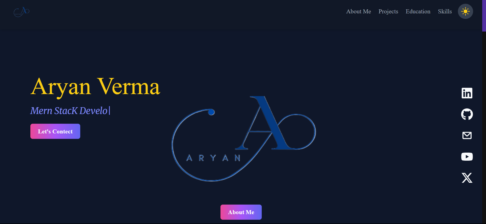

# 🚀 My Developer Portfolio

Welcome to my **Personal Portfolio Website** — built to showcase my skills, projects, and passion for building amazing digital experiences!

 

---

## 🌟 Features

- **Sleek UI:** Built with **React.js** + **Tailwind CSS** for a modern look
- **Dark/Light Mode:** Seamless theme switching
- **Projects Showcase:** Interactive project cards
- **Contact Form:** Send direct emails via **Nodemailer**
- **Responsive Design:** Mobile-friendly and fully responsive
- **Tech Stack Icons:** Hover effects and tooltips

---

## 🛠️ Tech Stack

| Frontend | Backend  | Others |
| React.js | Node.js + Express.js | Tailwind CSS |
| Framer Motion | Nodemailer |  Toast Notifications |
| Axios |  |  | CORS Handling |

---

## 📂 Project Structure

```bash
your-portfolio/
  ├── frontend/          # React app (UI)
  │   ├── public/
  │   └── src/

  ├── backend/           # Express server (Email handling)
  │   ├── email.js
  │   └── server.js
  ├── README.md
  
GMAIL_USER=your_email@gmail.com
GMAIL_PASSWORD=your_app_password

⚡ Note:

Use App Password instead of your Gmail password if 2FA is enabled.

Make sure to NEVER upload your .env to GitHub.

🌐 Live Demo 
👉 View Live Portfolio

📬 Contact Me
Email: raman809075@gmail.com

LinkedIn: Your LinkedIn

Instagram: @xt_aaryan

GitHub: @ArYann-13


    


⭐ Show Your Support
If you found this portfolio useful or cool, please ⭐ the repository!
It motivates me to keep building and sharing awesome projects.

✨ Made with ❤️ by Aryan

