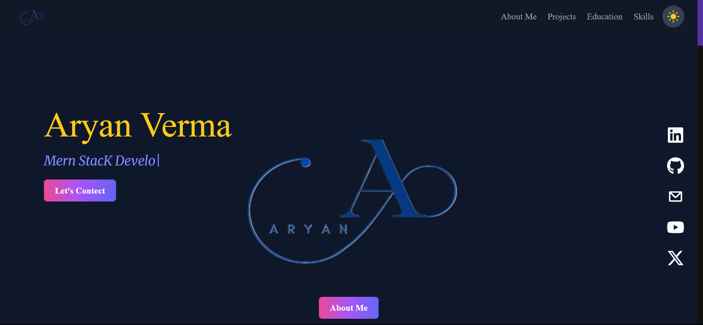
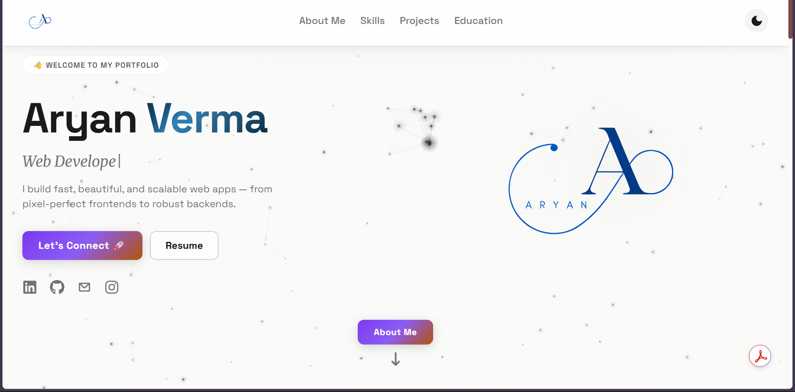

# 🚀 Aryan Verma – Developer Portfolio

<div align="center">
  
</div>
<div align="center">
  
</div>

<p align="center">
  <a href="https://aryann-portfolio.vercel.app/">
    <strong>Live Demo</strong>
  </a>
  •
  <a href="https://github.com/ArYann-13/my-portfolio">
    <strong>GitHub Repo</strong>
  </a>
</p>

---

## ✨ Features

- **Sleek UI** – Built with **React.js** and **Tailwind CSS** for a modern look.
- **Dark/Light Mode** – Seamless theme toggling.
- **Project Showcase** – Interactive cards with smooth hover animations.
- **Contact Form** – Direct email integration via **Resend.com**.
- **Responsive Design** – Mobile‑first, fully adaptive.
- **Micro‑Animations** – Framer Motion powered effects and tooltips.

---

## 🛠️ Tech Stack

### Frontend
- **Framework:** React.js
- **Styling:** Tailwind CSS
- **Animations:** Framer Motion
- **HTTP Client:** Axios
- **Notifications:** React Toastify

### Backend
- **Runtime:** Node.js
- **Framework:** Express.js
- **Email Service:** Resend
- **Middleware:** CORS

---

## 📦 Getting Started

```bash
# Clone the repository
git clone https://github.com/ArYann-13/my-portfolio.git
cd my-portfolio

# Frontend setup
cd frontend
npm install
npm start

# Backend setup (in a new terminal)
cd ../backend
npm install
node server.js
```

> ⚠️ **Note:** Create a `.env` file in `backend/` with your and add you Api from resend.com

---

## 📂 Project Structure

```text
my-portfolio/
├── frontend/          # React app
│   ├── public/        # Static assets (images, icons)
│   └── src/           # Components, styles, logic
│       └── components/
│       └── assets/
├── backend/           # Node/Express server
│   ├── email.js
│   └── server.js
└── README.md          # This documentation
```

---

## 📬 Contact Me

- **Email:** [raman809075@gmail.com](mailto:raman809075@gmail.com)
- **LinkedIn:** [Aryan Verma](https://www.linkedin.com/in/aryan-verma-a68580232)
- **Instagram:** [@xt_aaryan](https://instagram.com/xt_aaryan)
- **GitHub:** [@ArYann-13](https://github.com/ArYann-13)

---

## ⭐ Show Your Support

If you find this portfolio helpful, please give the repo a ⭐! Your support motivates me to keep building and sharing.

<div align="center">
  <p>✨ Made with ❤️ by <strong>Aryan Verma</strong> ✨</p>
</div>
